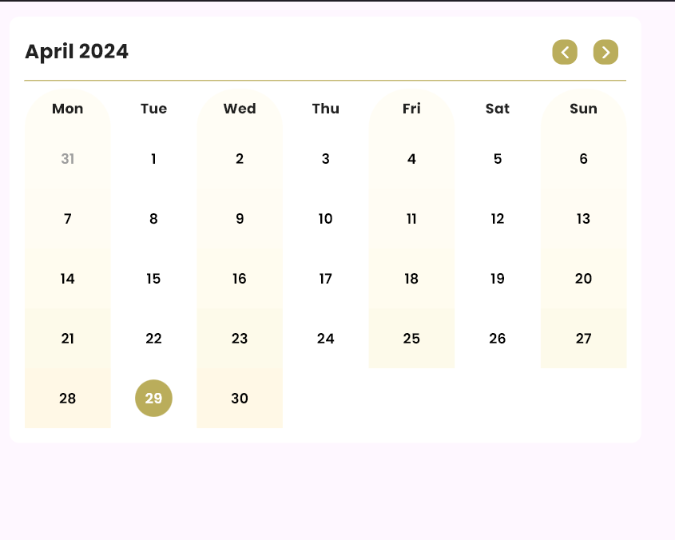

# CustomCalendar - A Dynamic Calendar Widget for Flutter

## Overview

**CustomCalendar** is a dynamic and customizable calendar widget for Flutter applications. It allows developers to initialize the calendar with a specific date and retrieve the selected date through a callback. This widget is perfect for creating interactive date pickers or calendar views in your Flutter app.

## Features

- **Initialize with a specific date**: Start the calendar at any date you prefer.
- **Date selection callback**: Get notified when a date is selected.
- **Dynamic month navigation**: Easily navigate between months.
- **Customizable appearance**: Modify the look and feel to match your app's theme.
- **Highlight today's date**: Easily identify the current day.
- **Gradient background**: Subtle gradient backgrounds for better visual separation.

## Installation

Add the following dependencies to your `pubspec.yaml` file:

    dependencies:
          flutter:
            sdk: flutter
          get:
          intl:
## Usage

To use the `CustomCalendar` widget in your Flutter app, follow these steps:

1.  **Import the necessary packages**:

    import 'package:flutter/material.dart';'package:your_app_path/app/components/dynamic_gridview/dynamic_height_grid_view.dart';

2. **Initialize the calendar**:

 `  class CalendarScreen extends StatelessWidget {
   @override
   Widget build(BuildContext context) {
   return Scaffold(
   body: Center(
   child: CustomCalendar(
   initialDate: DateTime.now(),
   onDateSelected: (selectedDate) {
   print("Selected date: $selectedDate");
   },
   ),
   ),
   );
   }
   }`

3.**Run your app**:

    void main() { runApp(MyApp()); } class MyApp extends StatelessWidget { @override Widget build(BuildContext context) { return GetMaterialApp( debugShowCheckedModeBanner: false, theme: LightTheme.getTheme(), navigatorObservers: [AppRouteObserver()], darkTheme: DarkTheme.getTheme(), home: CalendarScreen(), themeMode: ThemeMode.light, ); } }

## Contributing

If you'd like to contribute to the development of `CustomCalendar`, please follow these steps:

1.  Fork the repository.
2.  Create a new branch: `git checkout -b feature/your-feature`.
3.  Make your changes and commit them: `git commit -m 'Add some feature'`.
4.  Push to the branch: `git push origin feature/your-feature`.
5.  Submit a pull request.

## License

This project is licensed under the MIT License. See the LICENSE file for more details.

## Contact

If you have any questions or suggestions, feel free to open an issue or contact the repository owner.
